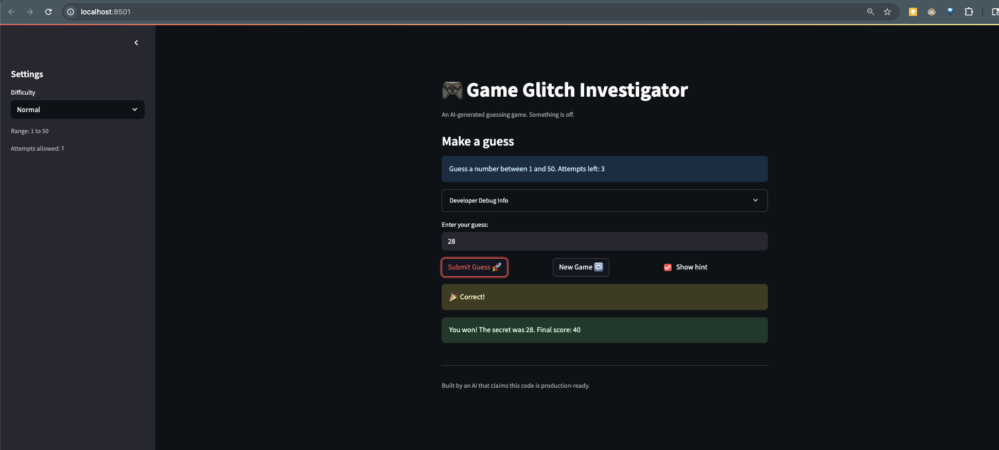

# 🎮 Game Glitch Investigator: The Impossible Guesser

## 🚨 The Situation

You asked an AI to build a simple "Number Guessing Game" using Streamlit.
It wrote the code, ran away, and now the game is unplayable.

- You can't win.
- The hints lie to you.
- The secret number seems to have commitment issues.

## 🛠️ Setup

1. Install dependencies: `pip install -r requirements.txt`
2. Run the broken app: `python -m streamlit run app.py`

## 🕵️‍♂️ Your Mission

1. **Play the game.** Open the "Developer Debug Info" tab in the app to see the secret number. Try to win.
2. **Find the State Bug.** Why does the secret number change every time you click "Submit"? Ask ChatGPT: *"How do I keep a variable from resetting in Streamlit when I click a button?"*
3. **Fix the Logic.** The hints ("Higher/Lower") are wrong. Fix them.
4. **Refactor & Test.** - Move the logic into `logic_utils.py`.
   - Run `pytest` in your terminal.
   - Keep fixing until all tests pass!

## 📝 Document Your Experience

**Game Purpose:**
This is a number guessing game built with Streamlit. The player picks a difficulty (Easy, Normal, or Hard), then tries to guess a randomly chosen secret number within a limited number of attempts. After each guess, the game gives a hint telling the player to go higher or lower. Points are awarded based on how few attempts it takes to win.

**Bugs Found:**
1. The secret number appeared to change on every guess because it was not stored in `st.session_state` Streamlit reruns the entire script on every interaction, so a plain variable would generate a new random number each time.
2. The hints were backwards — guessing too high told you to go higher, and guessing too low told you to go lower.
3. The difficulty modes had inverted attempt limits Easy had the fewest attempts and Hard had the most, which is the opposite of what difficulty should mean.
4. The number ranges were also inverted across difficulties — Easy had the widest range (hardest to guess) and Hard had the narrowest.
5. Clicking "New Game" reset the session variables but never called `st.rerun()`, so the UI stayed frozen on the old game state.

**Fixes Applied:**
1. Stored the secret number in `st.session_state` so it persists across Streamlit reruns and only generates once per game.
2. Fixed the `check_guess` logic in `logic_utils.py` so "Too High" returns "Go LOWER" and "Too Low" returns "Go HIGHER".
3. Corrected the attempt limit map so Easy=10, Normal=7, Hard=5.
4. Corrected `get_range_for_difficulty` so Easy=1–20, Normal=1–50, Hard=1–100.
5. Added `st.rerun()` after the New Game reset block so the UI refreshes immediately.
6. Refactored all game logic out of `app.py` and into `logic_utils.py`, then updated `app.py` to import from there.

## 📸 Demo

## 🚀 Stretch Features

- [ ] [If you choose to complete Challenge 4, insert a screenshot of your Enhanced Game UI here]
